## Overview

This project documents a full web application penetration test I carried out in my
home lab against two deliberately vulnerable training applications, **DVWA** and
**Mutillidae**, both hosted on a **Metasploitable2** target. The goal was to work
through the OWASP Top 10 end to end — from reconnaissance, to exploitation, to
writing the kind of client-facing report a real engagement produces, complete with
CVSS risk ratings and remediation advice.

> **Scope and authorisation.** All testing was performed against intentionally
> vulnerable applications running on machines I own, inside an isolated lab
> network with no route to the internet. Metasploitable2 and DVWA exist
> specifically for this kind of practice. Nothing here was tested against a system
> I wasn't authorised to touch.

**Environment**

| Role | Machine | Address |
|------|---------|---------|
| Attacker | Kali Linux | 192.168.0.1 |
| Target | Metasploitable2 (DVWA + Mutillidae) | 192.168.0.2 |

Connectivity between the two was confirmed by ICMP before starting.

---

## Methodology

I followed a standard testing flow: understand the target, map its attack surface,
then exploit what I found.

1. **Footprinting** the technology stack
2. **Scanning** the web server for known issues
3. **Content discovery** for hidden objects
4. **Spidering** the app to build a wordlist
5. **Proxy setup** for intercepting traffic
6. **Exploitation** of four distinct vulnerabilities

---

## Reconnaissance

### Technology stack

An Nmap service/version scan (`nmap 192.168.0.2 -sV`) mapped the open ports and
running services, and identified the host as Linux. To pin down the web application
stack specifically — which Nmap doesn't resolve well — I used **WhatWeb**, which
returned the web server and language in one line:

- **OS:** Ubuntu Linux
- **Web server:** Apache 2.2.8 (Ubuntu)
- **Language:** PHP 5.2.4

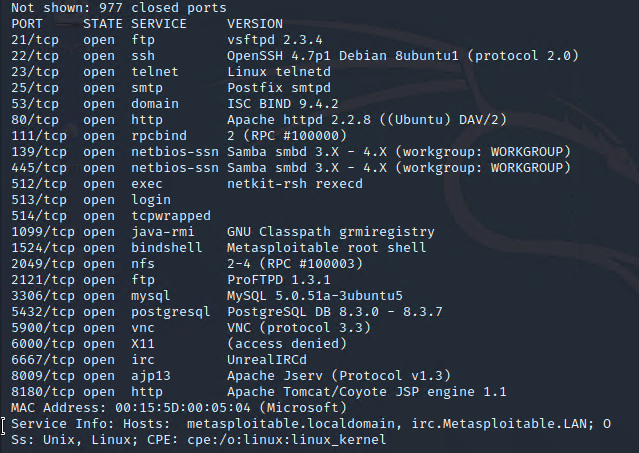

> **Lesson learned:** Nmap is the right tool for host/service discovery, but for
> fingerprinting a *web app's* stack (PHP, frameworks) a purpose-built tool like
> WhatWeb is far more reliable. Using the right tool for each layer matters.

### Web server scan

**Nikto** checked the Apache server against its vulnerability database. The headline
findings were three missing HTTP security headers:

- `X-Frame-Options` not present → clickjacking exposure
- `X-XSS-Protection` not defined → weakened browser XSS defence
- `X-Content-Type-Options` not set → MIME-sniffing exposure

Nikto also flagged the Apache version as outdated. Individually these are low
severity, but together they show a web server that hasn't been hardened.

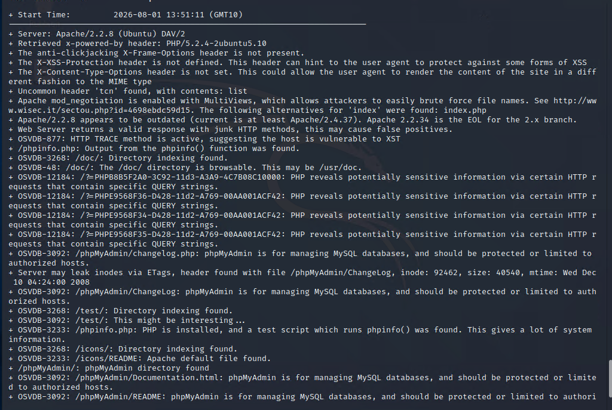

### Content discovery

**DIRB** ran a dictionary-based scan to uncover directories and files not linked
from the site. It found **56 objects**, expanding the attack surface.

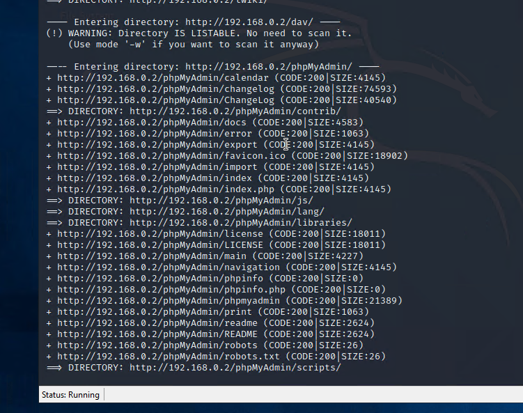

### Spidering

**CeWL** spidered Mutillidae to a depth of one level to build a custom lowercase
wordlist (`mu-words.txt`) — the kind of input you'd feed into a password-guessing
attack later.

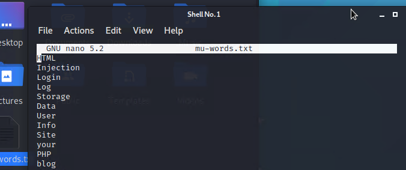

### Proxy setup

I installed **Burp Suite Community Edition** and configured Firefox to route its
traffic through Burp's intercepting proxy on `127.0.0.1:8080`, so I could capture
and modify requests for the exploitation phase.

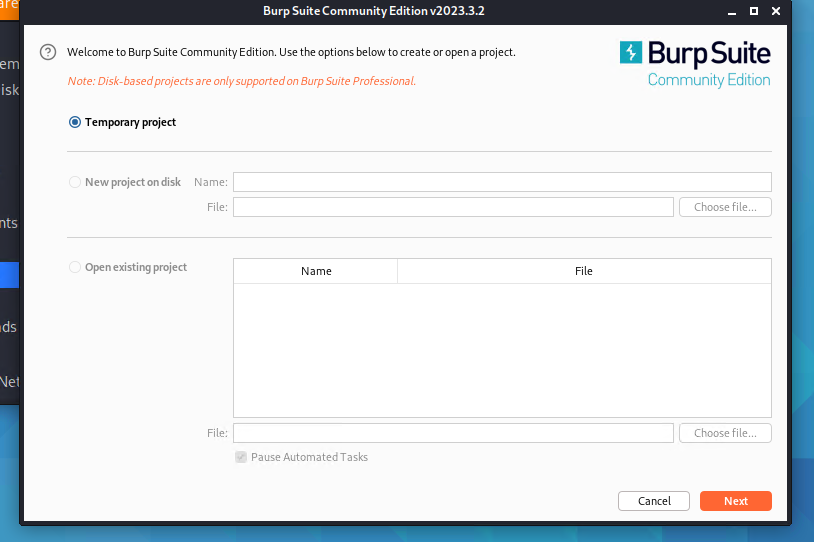

---

## Exploitation

Each vulnerability below includes a CVSS v2 base score. Vector strings are included
so the ratings are reproducible.

### 1. SQL Injection — CVSS 6.4 (Medium)

`AV:N/AC:L/Au:N/C:P/I:P/A:N`

DVWA built its database queries by inserting user input directly into the SQL
statement, with no parameterisation. By injecting a crafted string into the User ID
field, I was able to make the database return **the full list of registered users**.

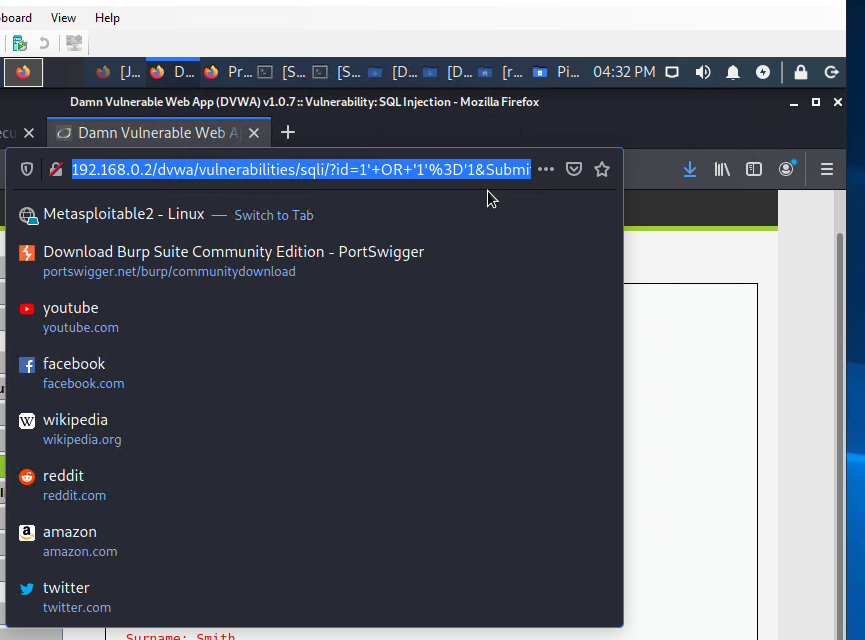
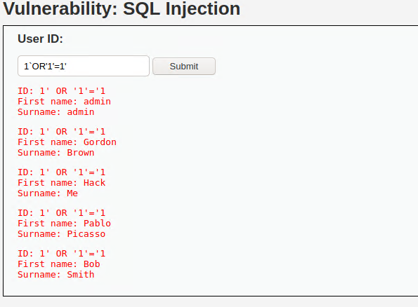

**Fix:** Use parameterised queries (prepared statements) so input is always treated
as data, never executable SQL. Apply least-privilege database accounts and suppress
detailed error messages.

### 2. Broken Authentication — CVSS 8.5 (High)

`AV:N/AC:L/Au:S/C:C/I:C/A:N`

Mutillidae tracked user identity in a **client-side cookie** containing the username
and user ID, and trusted it without verification. After registering and logging in
as a normal user, I intercepted the request in Burp, edited the cookie to point at
an administrator, and forwarded it — the server treated my session as the admin.
Full account takeover, no password required.

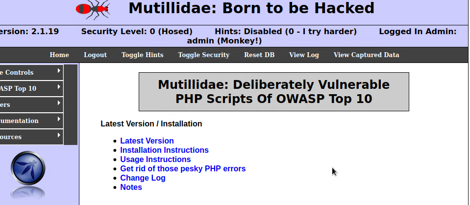

**Fix:** Never trust identity data stored client-side. Use a secure, random,
server-side session token, set cookies `HttpOnly` and `Secure`, and re-check
authorisation on every request.

### 3. Stored Cross-Site Scripting (XSS) — CVSS 4.3 (Medium)

`AV:N/AC:M/Au:N/C:N/I:P/A:N`

The DVWA guest book saved visitor messages and displayed them to everyone without
sanitising input. I stored a JavaScript payload
(``) which then executed in the
browser of **every subsequent visitor** to the page — persistent XSS.

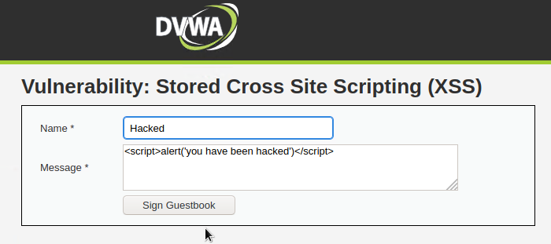
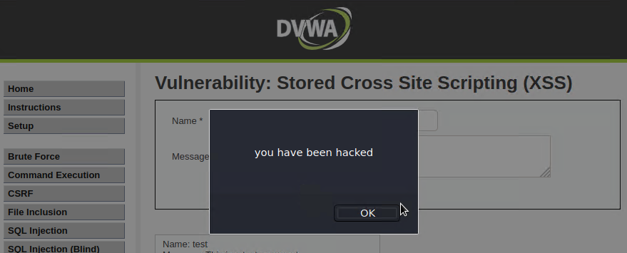

**Fix:** Encode all user-supplied output before rendering, validate input on
submission, and apply a Content Security Policy.

### 4. Insecure Direct Object Reference / Directory Traversal — CVSS 5.0 (Medium)

`AV:N/AC:L/Au:N/C:P/I:N/A:N`

Mutillidae loaded files based on a URL parameter without validating the path. By
injecting directory traversal sequences (`../`), I climbed out of the web directory
and read `/etc/passwd`, exposing **every system and service account** on the host.

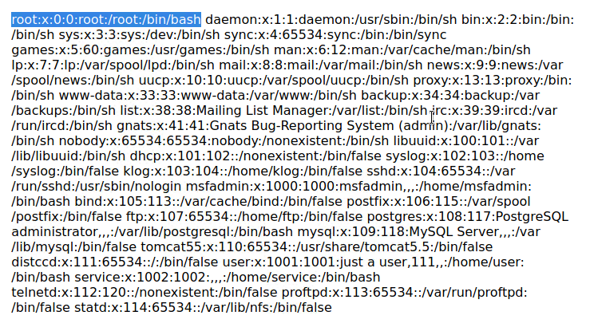

**Fix:** Never build file paths from unvalidated input. Whitelist allowed files,
reject traversal sequences, and run the web server with least-privilege file
permissions.

---

## Summary

| Vulnerability | CVSS v2 | Severity | Impact |
|---------------|---------|----------|--------|
| SQL Injection | 6.4 | Medium | Full user database exposed |
| Broken Authentication | 8.5 | High | Admin account takeover |
| Stored XSS | 4.3 | Medium | Code execution in every visitor's browser |
| Directory Traversal (IDOR) | 5.0 | Medium | Arbitrary system file disclosure |

The four vulnerabilities share one root cause: **user input is trusted without
validation, and access control isn't enforced server-side.** The consistent fixes
are input validation, parameterised queries, output encoding, secure server-side
session management, and strict file-path controls — backed by the HTTP security
headers the Nikto scan flagged as missing.

## What I took away from this

- **Recon compounds.** Each tool built on the last — Nmap found the server, WhatWeb
  named the stack, Nikto found the weaknesses, DIRB and CeWL expanded the surface.
  By exploitation time I already understood the target.
- **The report is the product.** Running an exploit is quick; translating it into
  business impact, a defensible risk score, and a fix a client can action is the
  part that actually matters in the field.
- **Right tool, right layer.** The Nmap-vs-WhatWeb distinction drove home that
  knowing *which* tool answers *which* question is a skill in itself.

*Lab writeup — tools: Kali Linux, Nmap, WhatWeb, Nikto, DIRB, CeWL, Burp Suite,
DVWA, Mutillidae, Metasploitable2.*
